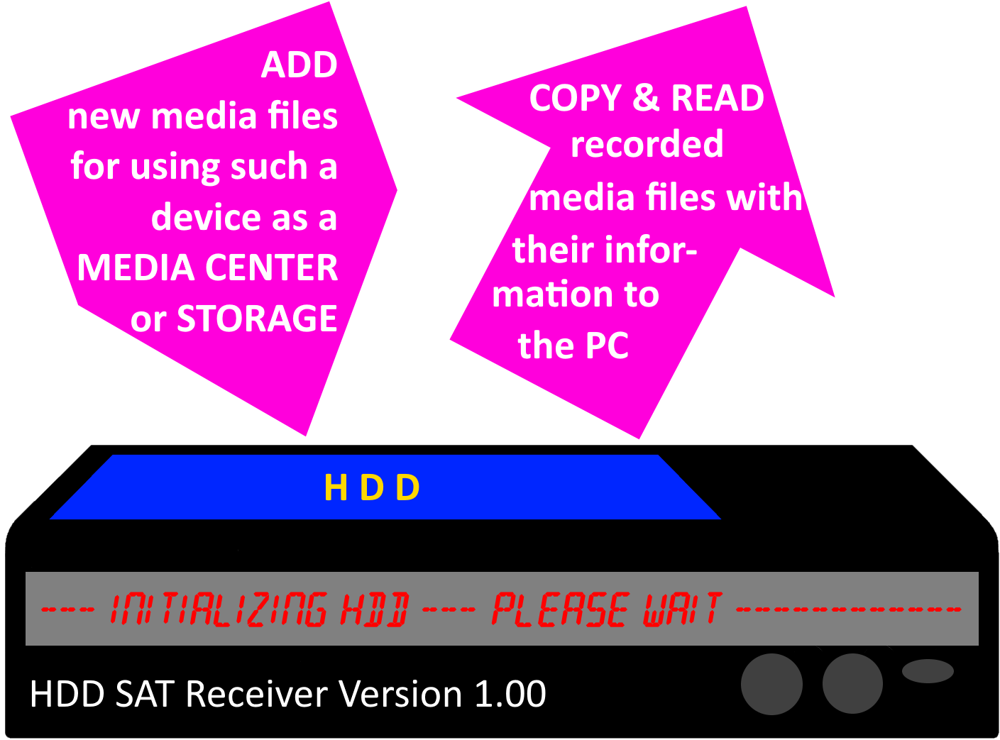

# ReceiverDAT

This APP reads from (and writes to) a meta.dat file created from HDD Satellite Receivers.
 
## 🏠 Current version:             1.0
## 🧬 Used Programming language:   PASCAL / Embarcadero Delphi
## 💻 Platform support:            cross-platform compiling is possible, tested under Win32
 
## :heavy_check_mark: It currently supports:
- [x] Reading from a .dat-file
- [x] Showing STATION, TITLE, YEAR, MONTH, DAY, HOUR and MINUTE of a recorded video file related with the .dat file
 
## 📅 It will support soon:
- [ ] Writing to a .dat-file
- [ ] Adding STATION, TITLE, YEAR, MONTH, DAY, HOUR and MINUTE to the .dat file for a special video file
- [ ] Combining everything (adding of video files to the receiver HDD with modified meta.dat files)
 
## 🔋 This repository contains:
- [x] the .dpr-file with the source code so you can open it in the Delphi IDE
- [x] a pre-compiled .exe for the Win32 platform
 
## ‼️ ATTENTION:
You MAY CHANGE the code, but do it AT YOUR OWN RISK. I spent six days for finding a working solution, so be happy that I maintaining this repository.
  
(c) 2021-2022 "RenderedIdeas_LAB" alias "achief-ws" alias "Danilo BLEUL"
